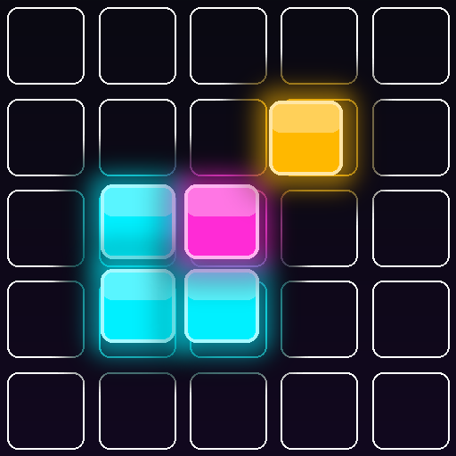
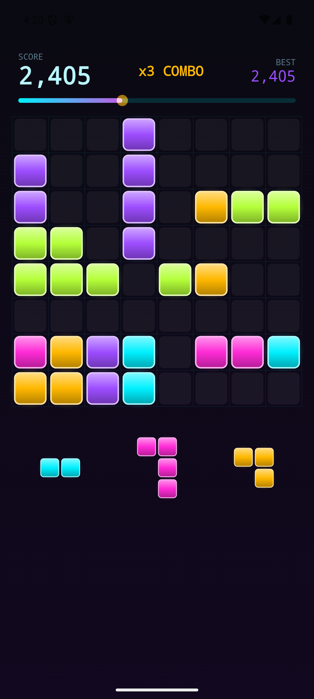
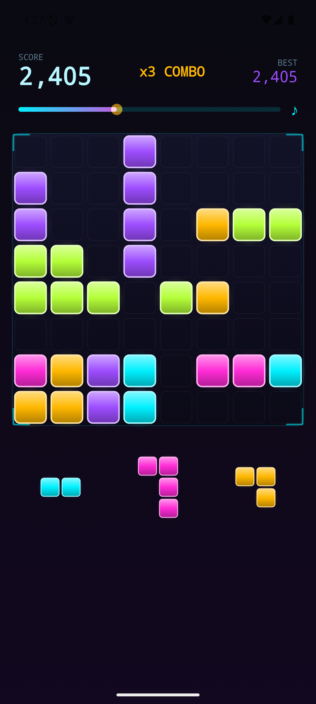
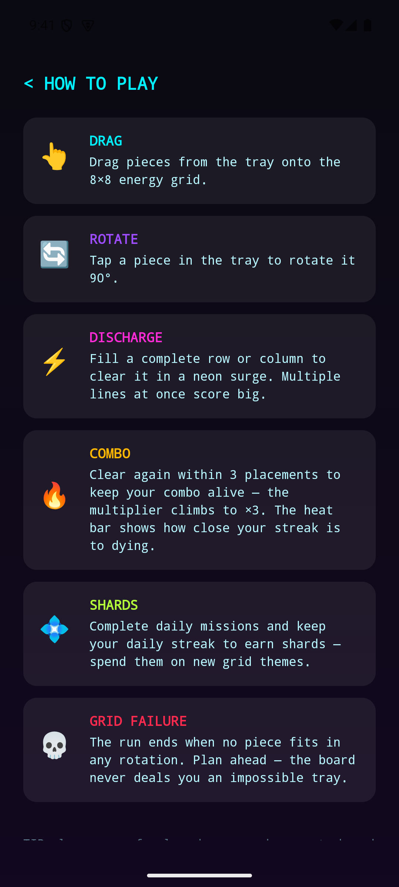
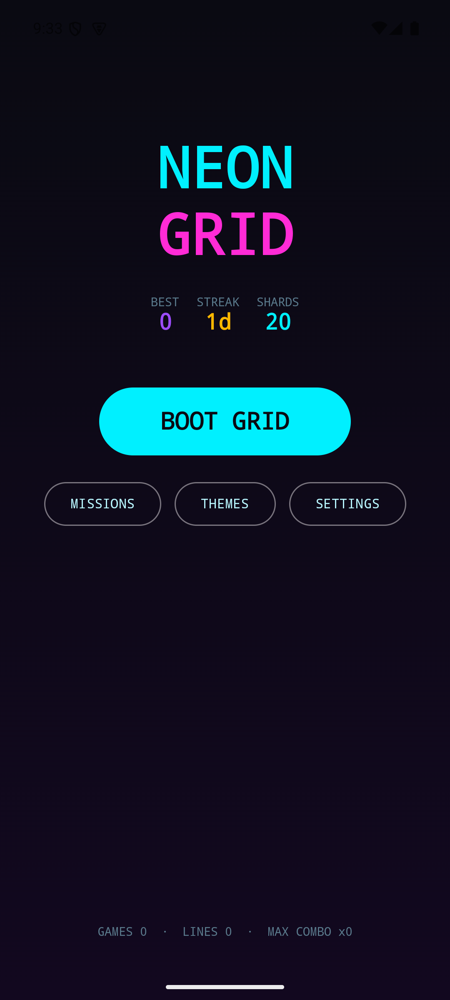

<div align="center">



# Cube Crash

**A neon block-puzzle game for Android — Kotlin and Jetpack Compose, built on a
pure-Kotlin engine with a test suite that plays the game to prove it stays fair.**

No ads. No in-app purchases. No accounts. No network.
The manifest requests exactly one permission: `VIBRATE`.






</div>

---

## The game

Drag the active piece onto an 8×8 grid; a NEXT slot previews what follows. Tap the
active piece to rotate it. Complete a row or column and it discharges. Chain clears
to build a combo multiplier — it dies after 3 placements without a clear. The run
ends when the piece you are holding fits nowhere.

Four tiers change both the clock and how generous the piece generator is:

| Tier | Clock per piece | Rotation | Generator |
|---|---|---|---|
| **Beginner** | untimed | yes | full assistance — small pieces when congested, line-finishers weighted up |
| **Intermediate** | 30s → 10s | yes | softened assistance |
| **Advanced** | 20s → 4s | yes | no bailouts, awkward shapes weighted up, fairness guarantee **off** |
| **Insane** | 15s → 3s | **no** | as Advanced, but every piece plays exactly as dealt |

The clock tightens as the score climbs.

---

## Why the code might interest you

### The board is one 64-bit integer

An 8×8 grid is 64 cells, so the entire occupancy map fits in a single `Long`.
Placing a piece is an `OR`. Testing a fit is an `AND` against zero. Clearing lines
is an `AND` with an inverted mask.

```kotlin
fun canPlace(board: Long, piece: Piece): Boolean =
    piece.placements.any { (it and board) == 0L }
```

Row and column completeness use `Long.bitCount`. No nested loops over a 2D array,
and the whole board is trivially cheap to copy, persist and compare.

### The engine is a pure function that knows nothing about Android

The `engine` module has **zero Android dependencies** — plain Kotlin, runs on the
JVM in a unit test. One entry point:

```kotlin
GameEngine.reduce(state, action, difficulty) -> Transition(newState, events)
```

State in; a new state and a list of events out. Nothing mutates. The `app` module
renders state and reacts to events — sound, haptics, particles, screen shake — and
holds no game rules at all.

Randomness is seeded and the RNG cursor lives inside the game state, so any run
replays exactly from its seed. That is what makes the next part possible.

### The tests play the game

The interesting question isn't "does a line score 100 points." It is **"is this
difficulty still winnable?"**

`DifficultyPlayabilityTest` implements a lookahead bot standing in for a careful
human: it never traps its own next piece, and otherwise keeps the board empty and
un-fragmented. It plays **620 seeded games** across the tiers and asserts on the
score *distribution* — at least 80% of careful runs must pass 2,000 points.

A second test proves a fairness invariant directly: on the guarantee-on tiers,
whenever the active piece fits, the piece behind it must still be placeable after
it. The game can never deal a pair that softlocks a careful player.

The test file is explicit about its own limits — it models turn logic only and
ignores the real-time clock. It shows the puzzle cannot softlock you on the way to
2,000; it does not show a human can beat a 15-second timer.

### Everything you hear is generated at runtime

No audio files ship with the app. The synthwave loop (Am–F–C–G, 110 BPM) and the
clear arpeggio — which climbs the scale as your combo grows — are synthesised in
code. Zero assets, zero licensing.

---

## Project layout

```
engine/                 pure Kotlin, no Android, tests run in ~1s
  Board.kt                bitboard masks, row/column operations
  GameEngine.kt           the reducer: (state, action) -> (state, events)
  PieceGenerator.kt       difficulty- and congestion-aware dealing
  BoardAnalyzer.kt        near-full line detection, gap analysis
  Scoring.kt              line values, combo multiplier, all-clear bonus
  Difficulty.kt           the four tiers and their tuning
  src/test/               playability and fairness suites

app/                    Android, Jetpack Compose
  game/                   ViewModels, drag handling, UI state
  ui/board/               canvas rendering of board, tray, dragged piece
  ui/fx/                  pooled particles, clear animation, trauma shake
  juice/                  procedural audio, music, haptics
  meta/                   daily streak, rotating missions, theme catalog
  data/                   DataStore persistence (CBOR), serializers

web-demo/               self-contained HTML5 port of the core loop
```

---

## Scoring

Clearing `n` lines simultaneously is worth `100 × n(n+1)/2`, so a double clear beats
two singles by a wide margin. That base is multiplied by a combo streak of
`1.0 + 0.25 × (streak − 1)`, capped at 3×. Emptying the board pays a 300-point
all-clear bonus.

---

## Building

Requires JDK 21 and the Android SDK (`local.properties` → `sdk.dir`).

```bash
./gradlew :engine:test              # the playability + fairness suites
./gradlew :app:assembleDebug        # debug APK
./gradlew :app:assembleRelease      # R8-minified release, ~1.1 MB
```

Try the core loop without Android:

```bash
python -m http.server 8123 -d web-demo
```

| | |
|---|---|
| Application ID | `com.dijastudios.cubecrash` |
| Version | 1.1.0 (versionCode 3) |
| Min SDK | 26 (Android 8.0) |
| Target / compile SDK | 36 |
| Release size | ~1.1 MB |

See [RELEASE.md](RELEASE.md) for signing and Play Store submission.

---

## Status

Built and signed as an Android App Bundle. Play Store listing in progress.

Built by **Amir Fouad** — [dija-technologies.com](https://dija-technologies.com)
